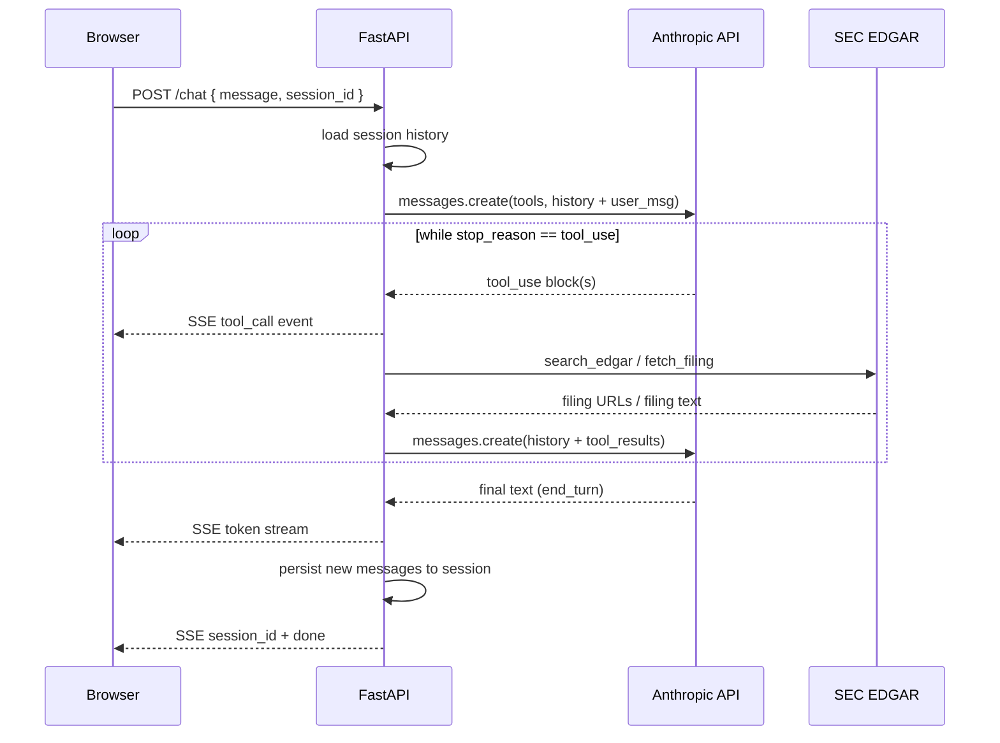
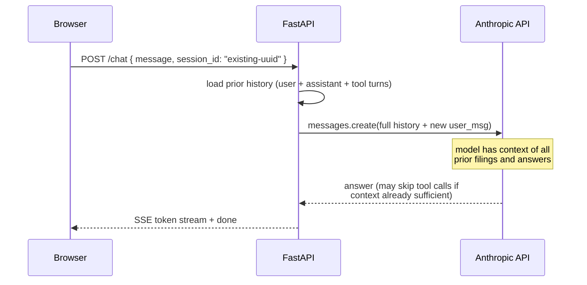

# EDGAR Agent — Manual Agent Loop · FastAPI · React · Anthropic / NVIDIA NIM

Full-stack AI agent that answers questions about public companies by fetching SEC EDGAR 10-K filings on demand.
The agent loop is implemented manually — no LangChain, no CrewAI — using the Anthropic tool-use API or NVIDIA NIM's
OpenAI-compatible function-calling interface. Responses stream token-by-token via SSE; tool calls are surfaced
live in the UI so you can watch the agent reason in real time.

---

## Using the App

### Single-turn queries

Type any natural-language question about a public company. The agent will:
1. Call `search_edgar` to find matching 10-K filings on SEC EDGAR.
2. Call `fetch_filing` on the most relevant result and extract readable text.
3. Stream a cited answer based on the filing content.

Good first queries:

- *"What was Apple's revenue for fiscal year 2023?"*
- *"Summarize Tesla's risk factors from their latest 10-K."*
- *"What does Nvidia say about its data center business?"*

### Sustained multi-turn conversation

The backend stores the full message history per session in memory. Pass the `session_id` returned in
the first response back on every subsequent request and the agent will have full context of everything
already fetched and discussed — it will not re-search EDGAR unless you explicitly ask about a new company
or a different filing period.

**Patterns that work well across turns:**

| What you want | How to phrase it |
|:--|:--|
| Follow up on the same filing | *"What does the same filing say about operating expenses?"* |
| Compare across years | *"Now fetch their 2021 10-K and compare revenue growth."* |
| Compare two companies | *"Do the same search for Microsoft and compare margins."* |
| Drill into a specific section | *"Go back to the risk-factors section — any mention of supply chain?"* |
| Summarise the session so far | *"Give me a one-paragraph summary of everything we've discussed."* |

**Practical tips:**

- **Session ID is the continuity key.** The UI holds it automatically; if you call the API directly, echo the `session_id` event from the first response and include it in every subsequent `POST /chat` body.
- **In-memory only.** Sessions are not persisted to disk — restarting the backend clears all history. Start a new conversation rather than expecting to resume after a restart.
- **12 K char filing cap.** `fetch_filing` returns at most the first 12 000 characters of a filing. For very long 10-Ks the agent may miss later sections; ask it to *"fetch the filing index page and look for the specific exhibit"* if you need a deeper section.
- **Tool visibility.** Every `tool_call` SSE event names the tool and its input. If the agent searches for the wrong company name (e.g., ticker vs. legal name), correct it in the next message: *"Search for 'Alphabet Inc' instead of 'Google'."*
- **Provider switch.** Set `MODEL_PROVIDER=nvidia` in `.env` and restart the backend to switch to Nemotron. The same session history works — the format translation happens inside `run_agent_nvidia`.

---

## Running

```bash
./scripts/deploy.sh
```

---

| Component | Implementation |
|---|---|
| **Agent loop** | Manual `while stop_reason == "tool_use"` loop; tool results appended as `user` messages per Anthropic's multi-turn tool-use protocol |
| **Tools** | `search_edgar` — EDGAR full-text search API, returns top-5 10-K filing URLs; `fetch_filing` — HTTP GET + BeautifulSoup HTML strip, first 12 K chars |
| **Default model** | `claude-sonnet-5` (Anthropic) — switched to NVIDIA NIM `llama-3.1-nemotron-ultra-253b-v1` via `MODEL_PROVIDER=nvidia` env var |
| **Streaming** | FastAPI `EventSourceResponse` (sse-starlette); yields `token`, `tool_call`, `session_id`, and `done` event types |
| **Session storage** | In-process `defaultdict(list)` keyed by UUID; no external DB required |
| **Backend** | FastAPI 0.115, Python 3.11+; `uvicorn` for local dev; Dockerfile present for containerised deploy |
| **Frontend** | React 18 + Vite + TypeScript; plain `fetch` EventSource consumer; no UI framework |
| **Tests** | `simulation_tests.py` — 5 scripted keyword-match scenarios; `eval.py` — LLM-as-judge scoring (1–5) via `claude-sonnet-5` |

---

## Architecture

### Agent loop — step by step

1. **Browser → FastAPI** — `POST /chat { message, session_id? }` arrives; FastAPI loads the session's message history and appends the new user message.
2. **FastAPI → Anthropic** — `messages.create(tools=[search_edgar, fetch_filing], messages=history)` is called with the full accumulated context.
3. **`stop_reason == "tool_use"`** — the model decides to call a tool. The assistant turn (with `tool_use` blocks) is appended to the message list; tools are executed; results are appended as a `user` turn containing `tool_result` blocks.
4. **Re-prompt** — `messages.create` is called again with the expanded history. Steps 3–4 repeat until the model is ready to answer.
5. **`stop_reason == "end_turn"`** — the model produces a final answer. `messages.stream` replays the same call and yields tokens as `token` SSE events; the completed assistant message is persisted to the session.
6. **Session persistence** — only the messages added after step 1 are appended; existing history is never re-written.



### Multi-turn flow (second and later messages)



### Key design decisions

| Concern | Approach |
|:--|:--|
| **No framework** | Agent loop is a plain `while` loop; Anthropic's tool-use protocol is straightforward enough that LangChain adds no value and obscures the message list |
| **Full history on every call** | The complete `messages` list is sent on every `messages.create` call — the model can reference any prior filing text or answer without re-fetching |
| **Tool results as user turns** | Anthropic requires tool results in a `user` role message; NVIDIA NIM expects `role: "tool"` — `run_agent_nvidia` handles the format difference transparently |
| **SSE over WebSocket** | One-directional server-push is sufficient; SSE is simpler to implement and works over standard HTTP without upgrade negotiation |
| **In-memory sessions** | No Redis or DB dependency keeps local setup to a single `uvicorn` command; acceptable trade-off for a demo where session loss on restart is not a problem |
| **12 K char filing cap** | Balances context-window cost vs. completeness; most material facts (revenue, risk factors, segment results) appear in the first third of a 10-K |
| **Same embeddings constraint (N/A)** | This agent does no vector search — EDGAR text is injected directly into the LLM context, so there is no embedding mismatch risk |

## API

### `POST /chat`

```json
{ "message": "What was Apple's revenue in 2023?", "session_id": "optional-uuid" }
```

Streams SSE events:

| Event type | Payload |
|---|---|
| `token` | `{"type":"token","text":"..."}` |
| `tool_call` | `{"type":"tool_call","tool":"search_edgar","input":{...}}` |
| `session_id` | `{"type":"session_id","session_id":"uuid"}` |
| `done` | `{"type":"done","messages":[...]}` |

### `GET /sessions/{session_id}/history`

Returns the full conversation history for a session.

## Tests

Backend must be running on port 8000.

```
python tests/simulation_tests.py
```

5 scripted scenarios — checks that answers contain expected keywords.

```
python tests/eval.py
```

LLM-as-judge (`claude-sonnet-5`) — scores each of 5 conversations 1–5 on relevance and accuracy, prints averages.
